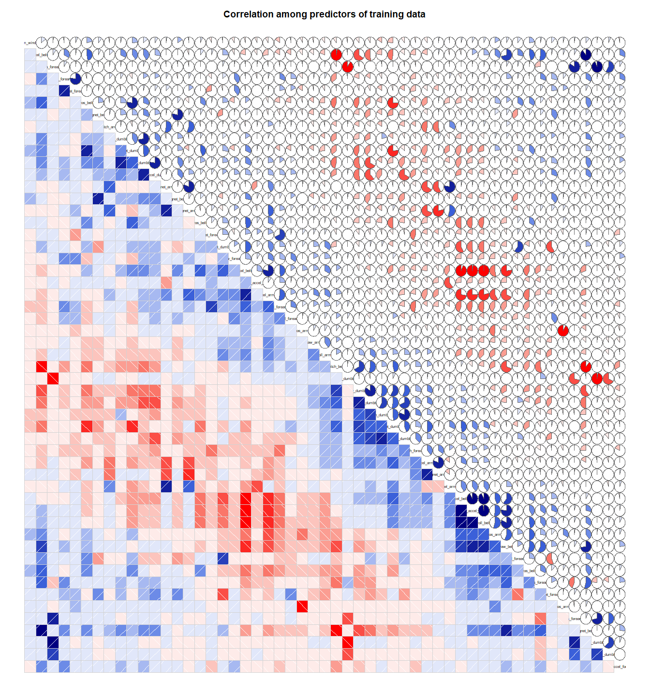
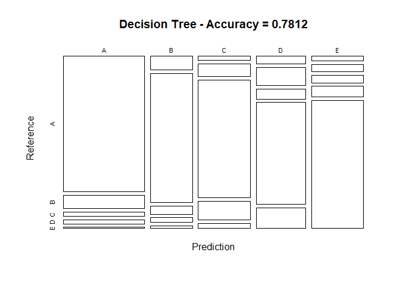
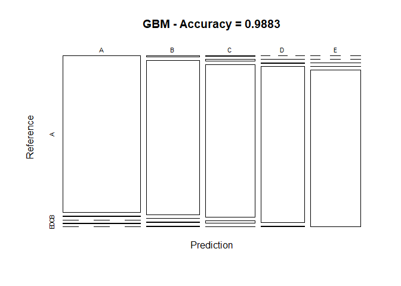
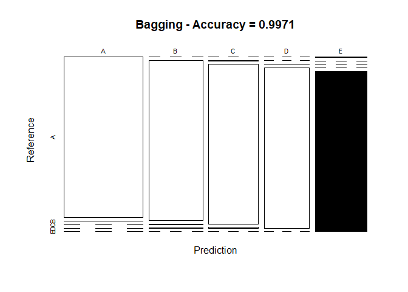
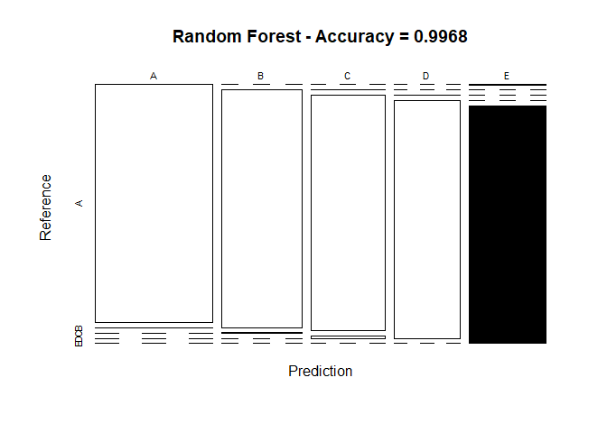

## Introduction

One thing that people regularly do is quantify how much of a particular activity they do, but they rarely quantify how well they do it. In this project, our goal will be to use data from accelerometers on the belt, forearm, arm, and dumbell of 6 participants.

The goal of our project is to predict the manner in which they did the exercise. This is the "classe" variable in the training set. We may use any of the other variables to predict with. We should descibe how to build our model, how we used cross validation, what we think the expected out of sample error is, and why we made the choices to select the parcticular prediction models over the others. We will also use your prediction model to predict 20 different test cases.

## Background

Using devices such as Jawbone Up, Nike FuelBand, and Fitbit it is now possible to collect a large amount of data about personal activity relatively inexpensively. These type of devices are part of the quantified self movement – a group of enthusiasts who take measurements about themselves regularly to improve their health, to find patterns in their behavior, or because they are tech geeks. One thing that people regularly do is quantify how much of a particular activity they do, but they rarely quantify how well they do it. In this project, your goal will be to use data from accelerometers on the belt, forearm, arm, and dumbell of 6 participants. They were asked to perform barbell lifts correctly and incorrectly in 5 different ways. More information is available from the website here: <a href = "http://groupware.les.inf.puc-rio.br/har"> http://groupware.les.inf.puc-rio.br/har </a> (see the section on the Weight Lifting Exercise Dataset).

## Data

The training data for this project are available here:

<a href = https://d396qusza40orc.cloudfront.net/predmachlearn/pml-training.csv> https://d396qusza40orc.cloudfront.net/predmachlearn/pml-training.csv </a>

The test data are available here:

<a href = https://d396qusza40orc.cloudfront.net/predmachlearn/pml-testing.csv> https://d396qusza40orc.cloudfront.net/predmachlearn/pml-testing.csv </a>

**The data for this project come from this source: <a href = http://groupware.les.inf.puc-rio.br/har>http://groupware.les.inf.puc-rio.br/har</a>.**

### Loading the Dataset

After loading the data we change the name of variable `problem_id` of test data to `classe` as well as it's class from *integer*  to that of the class of `classe` i.e. *factor* as it will help us later when we predict our test data using our predictive model.


```r
train_data<- read.csv("pml-training.csv", header = TRUE, na.strings=c(" ","","NA"))
test_data<- read.csv("pml-testing.csv", header = TRUE, na.strings=c(" ","","NA"))
# making problem_id column of test_set to classe column as 
names(test_data)[160]<- "classe"
# converting the class of that column to that of class of classe variable of train_data
test_data$classe<- as.factor(test_data$classe)
```

### Cleaning the Dataset

Counting no. of variables of train and test data which has NA's greater than 5%.


```r
dim(train_data)
```

```
## [1] 19622   160
```

```r
dim(test_data)
```

```
## [1]  20 160
```

```r
isNA<- function(x){sum(is.na(x))/length(x)}
sum(sapply(train_data,isNA)> 0.05)
```

```
## [1] 100
```

```r
sum(sapply(test_data,isNA)> 0.05)
```

```
## [1] 100
```

Removing those variables which has more than 5% NA's as well as removing first five column of test and training data as it contains details about individual performing the task and it has nothing to do with predicting the `classe` variable as this variable doesn't depends on them.


```r
train_data<- train_data[,sapply(train_data,isNA)< 0.05]
test_data<- test_data[,sapply(test_data,isNA)< 0.05]
train_data<- train_data[,-c(1:5)]
test_data<- test_data[,-c(1:5)]
dim(train_data)
```

```
## [1] 19622    55
```

```r
dim(test_data)
```

```
## [1] 20 55
```

Now talking a look at clean dataset using `summary` function.


```r
summary(train_data)
```

```
##  new_window    num_window      roll_belt        pitch_belt      
##  no :19216   Min.   :  1.0   Min.   :-28.90   Min.   :-55.8000  
##  yes:  406   1st Qu.:222.0   1st Qu.:  1.10   1st Qu.:  1.7600  
##              Median :424.0   Median :113.00   Median :  5.2800  
##              Mean   :430.6   Mean   : 64.41   Mean   :  0.3053  
##              3rd Qu.:644.0   3rd Qu.:123.00   3rd Qu.: 14.9000  
##              Max.   :864.0   Max.   :162.00   Max.   : 60.3000  
##     yaw_belt       total_accel_belt  gyros_belt_x        gyros_belt_y     
##  Min.   :-180.00   Min.   : 0.00    Min.   :-1.040000   Min.   :-0.64000  
##  1st Qu.: -88.30   1st Qu.: 3.00    1st Qu.:-0.030000   1st Qu.: 0.00000  
##  Median : -13.00   Median :17.00    Median : 0.030000   Median : 0.02000  
##  Mean   : -11.21   Mean   :11.31    Mean   :-0.005592   Mean   : 0.03959  
##  3rd Qu.:  12.90   3rd Qu.:18.00    3rd Qu.: 0.110000   3rd Qu.: 0.11000  
##  Max.   : 179.00   Max.   :29.00    Max.   : 2.220000   Max.   : 0.64000  
##   gyros_belt_z      accel_belt_x       accel_belt_y     accel_belt_z    
##  Min.   :-1.4600   Min.   :-120.000   Min.   :-69.00   Min.   :-275.00  
##  1st Qu.:-0.2000   1st Qu.: -21.000   1st Qu.:  3.00   1st Qu.:-162.00  
##  Median :-0.1000   Median : -15.000   Median : 35.00   Median :-152.00  
##  Mean   :-0.1305   Mean   :  -5.595   Mean   : 30.15   Mean   : -72.59  
##  3rd Qu.:-0.0200   3rd Qu.:  -5.000   3rd Qu.: 61.00   3rd Qu.:  27.00  
##  Max.   : 1.6200   Max.   :  85.000   Max.   :164.00   Max.   : 105.00  
##  magnet_belt_x   magnet_belt_y   magnet_belt_z       roll_arm      
##  Min.   :-52.0   Min.   :354.0   Min.   :-623.0   Min.   :-180.00  
##  1st Qu.:  9.0   1st Qu.:581.0   1st Qu.:-375.0   1st Qu.: -31.77  
##  Median : 35.0   Median :601.0   Median :-320.0   Median :   0.00  
##  Mean   : 55.6   Mean   :593.7   Mean   :-345.5   Mean   :  17.83  
##  3rd Qu.: 59.0   3rd Qu.:610.0   3rd Qu.:-306.0   3rd Qu.:  77.30  
##  Max.   :485.0   Max.   :673.0   Max.   : 293.0   Max.   : 180.00  
##    pitch_arm          yaw_arm          total_accel_arm  gyros_arm_x      
##  Min.   :-88.800   Min.   :-180.0000   Min.   : 1.00   Min.   :-6.37000  
##  1st Qu.:-25.900   1st Qu.: -43.1000   1st Qu.:17.00   1st Qu.:-1.33000  
##  Median :  0.000   Median :   0.0000   Median :27.00   Median : 0.08000  
##  Mean   : -4.612   Mean   :  -0.6188   Mean   :25.51   Mean   : 0.04277  
##  3rd Qu.: 11.200   3rd Qu.:  45.8750   3rd Qu.:33.00   3rd Qu.: 1.57000  
##  Max.   : 88.500   Max.   : 180.0000   Max.   :66.00   Max.   : 4.87000  
##   gyros_arm_y       gyros_arm_z       accel_arm_x       accel_arm_y    
##  Min.   :-3.4400   Min.   :-2.3300   Min.   :-404.00   Min.   :-318.0  
##  1st Qu.:-0.8000   1st Qu.:-0.0700   1st Qu.:-242.00   1st Qu.: -54.0  
##  Median :-0.2400   Median : 0.2300   Median : -44.00   Median :  14.0  
##  Mean   :-0.2571   Mean   : 0.2695   Mean   : -60.24   Mean   :  32.6  
##  3rd Qu.: 0.1400   3rd Qu.: 0.7200   3rd Qu.:  84.00   3rd Qu.: 139.0  
##  Max.   : 2.8400   Max.   : 3.0200   Max.   : 437.00   Max.   : 308.0  
##   accel_arm_z       magnet_arm_x     magnet_arm_y     magnet_arm_z   
##  Min.   :-636.00   Min.   :-584.0   Min.   :-392.0   Min.   :-597.0  
##  1st Qu.:-143.00   1st Qu.:-300.0   1st Qu.:  -9.0   1st Qu.: 131.2  
##  Median : -47.00   Median : 289.0   Median : 202.0   Median : 444.0  
##  Mean   : -71.25   Mean   : 191.7   Mean   : 156.6   Mean   : 306.5  
##  3rd Qu.:  23.00   3rd Qu.: 637.0   3rd Qu.: 323.0   3rd Qu.: 545.0  
##  Max.   : 292.00   Max.   : 782.0   Max.   : 583.0   Max.   : 694.0  
##  roll_dumbbell     pitch_dumbbell     yaw_dumbbell      total_accel_dumbbell
##  Min.   :-153.71   Min.   :-149.59   Min.   :-150.871   Min.   : 0.00       
##  1st Qu.: -18.49   1st Qu.: -40.89   1st Qu.: -77.644   1st Qu.: 4.00       
##  Median :  48.17   Median : -20.96   Median :  -3.324   Median :10.00       
##  Mean   :  23.84   Mean   : -10.78   Mean   :   1.674   Mean   :13.72       
##  3rd Qu.:  67.61   3rd Qu.:  17.50   3rd Qu.:  79.643   3rd Qu.:19.00       
##  Max.   : 153.55   Max.   : 149.40   Max.   : 154.952   Max.   :58.00       
##  gyros_dumbbell_x    gyros_dumbbell_y   gyros_dumbbell_z  accel_dumbbell_x 
##  Min.   :-204.0000   Min.   :-2.10000   Min.   : -2.380   Min.   :-419.00  
##  1st Qu.:  -0.0300   1st Qu.:-0.14000   1st Qu.: -0.310   1st Qu.: -50.00  
##  Median :   0.1300   Median : 0.03000   Median : -0.130   Median :  -8.00  
##  Mean   :   0.1611   Mean   : 0.04606   Mean   : -0.129   Mean   : -28.62  
##  3rd Qu.:   0.3500   3rd Qu.: 0.21000   3rd Qu.:  0.030   3rd Qu.:  11.00  
##  Max.   :   2.2200   Max.   :52.00000   Max.   :317.000   Max.   : 235.00  
##  accel_dumbbell_y  accel_dumbbell_z  magnet_dumbbell_x magnet_dumbbell_y
##  Min.   :-189.00   Min.   :-334.00   Min.   :-643.0    Min.   :-3600    
##  1st Qu.:  -8.00   1st Qu.:-142.00   1st Qu.:-535.0    1st Qu.:  231    
##  Median :  41.50   Median :  -1.00   Median :-479.0    Median :  311    
##  Mean   :  52.63   Mean   : -38.32   Mean   :-328.5    Mean   :  221    
##  3rd Qu.: 111.00   3rd Qu.:  38.00   3rd Qu.:-304.0    3rd Qu.:  390    
##  Max.   : 315.00   Max.   : 318.00   Max.   : 592.0    Max.   :  633    
##  magnet_dumbbell_z  roll_forearm       pitch_forearm     yaw_forearm     
##  Min.   :-262.00   Min.   :-180.0000   Min.   :-72.50   Min.   :-180.00  
##  1st Qu.: -45.00   1st Qu.:  -0.7375   1st Qu.:  0.00   1st Qu.: -68.60  
##  Median :  13.00   Median :  21.7000   Median :  9.24   Median :   0.00  
##  Mean   :  46.05   Mean   :  33.8265   Mean   : 10.71   Mean   :  19.21  
##  3rd Qu.:  95.00   3rd Qu.: 140.0000   3rd Qu.: 28.40   3rd Qu.: 110.00  
##  Max.   : 452.00   Max.   : 180.0000   Max.   : 89.80   Max.   : 180.00  
##  total_accel_forearm gyros_forearm_x   gyros_forearm_y     gyros_forearm_z   
##  Min.   :  0.00      Min.   :-22.000   Min.   : -7.02000   Min.   : -8.0900  
##  1st Qu.: 29.00      1st Qu.: -0.220   1st Qu.: -1.46000   1st Qu.: -0.1800  
##  Median : 36.00      Median :  0.050   Median :  0.03000   Median :  0.0800  
##  Mean   : 34.72      Mean   :  0.158   Mean   :  0.07517   Mean   :  0.1512  
##  3rd Qu.: 41.00      3rd Qu.:  0.560   3rd Qu.:  1.62000   3rd Qu.:  0.4900  
##  Max.   :108.00      Max.   :  3.970   Max.   :311.00000   Max.   :231.0000  
##  accel_forearm_x   accel_forearm_y  accel_forearm_z   magnet_forearm_x 
##  Min.   :-498.00   Min.   :-632.0   Min.   :-446.00   Min.   :-1280.0  
##  1st Qu.:-178.00   1st Qu.:  57.0   1st Qu.:-182.00   1st Qu.: -616.0  
##  Median : -57.00   Median : 201.0   Median : -39.00   Median : -378.0  
##  Mean   : -61.65   Mean   : 163.7   Mean   : -55.29   Mean   : -312.6  
##  3rd Qu.:  76.00   3rd Qu.: 312.0   3rd Qu.:  26.00   3rd Qu.:  -73.0  
##  Max.   : 477.00   Max.   : 923.0   Max.   : 291.00   Max.   :  672.0  
##  magnet_forearm_y magnet_forearm_z classe  
##  Min.   :-896.0   Min.   :-973.0   A:5580  
##  1st Qu.:   2.0   1st Qu.: 191.0   B:3797  
##  Median : 591.0   Median : 511.0   C:3422  
##  Mean   : 380.1   Mean   : 393.6   D:3216  
##  3rd Qu.: 737.0   3rd Qu.: 653.0   E:3607  
##  Max.   :1480.0   Max.   :1090.0
```

## Explortory Data Analysis

We should check the correlation among variables before proceeding to the modeling procedures as it helps in analysing the scope of further dimension reduction of training data using PCA.


```r
library(corrgram)
```

```
## Registered S3 method overwritten by 'seriation':
##   method         from 
##   reorder.hclust gclus
```

```r
corrgram(train_data, order=TRUE, lower.panel=panel.shade,
  upper.panel=panel.pie, text.panel=panel.txt,
  main="Correlation among predictors of training data")
```

<!-- -->

**Some Rendering for Correlation Values**


**The order of variables of training data in the diagonal panel in correlation plot is same as that of order of variable in summary of train_data shown previously.**

From above after visualizing the correlation among the variables of training data, we can see that there is not much correlation among many variables and we can move forward towards the modelling of data without worrying much about the correlation factor.

## Prediction Model Building

### 1.) Classification Decision Tree
We first use classification trees to analyze the train data set.We have to predict classe variable from rest of the variable in the data set. We are using `rpart` package for predicting the decision tree and using `rattle` and `rpart.plot` function for ploting the fancy decision tree. 

Dividing the `train_data` in training data and cross-validation data. Here we are using validation set approach.

```r
suppressMessages(library(randomForest))
suppressMessages(library(caret))
set.seed(1)
inTrain  <- sample(1:nrow(train_data), .7*nrow(train_data),replace = FALSE)
train<- train_data[inTrain,]
cv<- train_data[-inTrain,]
```


```r
suppressMessages(library(rattle))
suppressMessages(library(rpart.plot))
suppressMessages(library(rpart))
set.seed(2)
tree.WLE<- rpart(classe~. , train, method="class")
```

The `summary()` function the gives the number of terminal nodes, lists the variables that are used as internal nodes in the tree and the (training) error rate.


```r
suppressWarnings(fancyRpartPlot(tree.WLE))
```

<!-- -->


```r
tree.pred <- predict(tree.WLE ,cv, type ="class")
DecTreeConfMat<- confusionMatrix(tree.pred, cv$classe)
DecTreeConfMat
```

```
## Confusion Matrix and Statistics
## 
##           Reference
## Prediction    A    B    C    D    E
##          A 1479  147   50   42   13
##          B   76  729   46   25   16
##          C   28   91  830  132   36
##          D   50  120   68  677  138
##          E   31   53   52   74  884
## 
## Overall Statistics
##                                           
##                Accuracy : 0.7812          
##                  95% CI : (0.7704, 0.7917)
##     No Information Rate : 0.2827          
##     P-Value [Acc > NIR] : < 2.2e-16       
##                                           
##                   Kappa : 0.7233          
##                                           
##  Mcnemar's Test P-Value : < 2.2e-16       
## 
## Statistics by Class:
## 
##                      Class: A Class: B Class: C Class: D Class: E
## Sensitivity            0.8888   0.6395   0.7935   0.7126   0.8132
## Specificity            0.9403   0.9657   0.9407   0.9238   0.9563
## Pos Pred Value         0.8544   0.8173   0.7431   0.6429   0.8080
## Neg Pred Value         0.9555   0.9177   0.9547   0.9435   0.9576
## Prevalence             0.2827   0.1936   0.1777   0.1614   0.1846
## Detection Rate         0.2512   0.1238   0.1410   0.1150   0.1502
## Detection Prevalence   0.2940   0.1515   0.1897   0.1789   0.1858
## Balanced Accuracy      0.9146   0.8026   0.8671   0.8182   0.8847
```


```r
plot(DecTreeConfMat$table, col = DecTreeConfMat$byClass, 
     main = paste("Decision Tree - Accuracy =",
                  round(DecTreeConfMat$overall['Accuracy'], 4)))
```

<!-- -->


### 2.) Boosting

Using `caret` package as it is difficult to assume the argument `n.tree` and `interaction.depth` in `gbm` function ,`caret` should handle all the parameter stuff. As in `gbm` package we have to assume `n.tree` and `interation.depth` argument initially and select the best one using cross-validation method which might be hectic in comparision to that of boosting done by `caret` as most of the cross-validation and assuming appropriate `n.tree` and `interaction.depth` is done by the function present in caret package itself.


```r
set.seed(5)
controlGBM <- trainControl(method = "repeatedcv", number = 5, repeats = 1)
GBM.WLE  <- train(classe ~ ., data= train, method = "gbm",
                    trControl = controlGBM, verbose = FALSE)
GBM.WLE
```

```
## Stochastic Gradient Boosting 
## 
## 13735 samples
##    54 predictor
##     5 classes: 'A', 'B', 'C', 'D', 'E' 
## 
## No pre-processing
## Resampling: Cross-Validated (5 fold, repeated 1 times) 
## Summary of sample sizes: 10988, 10987, 10988, 10989, 10988 
## Resampling results across tuning parameters:
## 
##   interaction.depth  n.trees  Accuracy   Kappa    
##   1                   50      0.7567538  0.6913083
##   1                  100      0.8320344  0.7874135
##   1                  150      0.8713500  0.8371614
##   2                   50      0.8861305  0.8557374
##   2                  100      0.9394977  0.9234346
##   2                  150      0.9614853  0.9512587
##   3                   50      0.9310528  0.9126975
##   3                  100      0.9702225  0.9623141
##   3                  150      0.9871132  0.9836949
## 
## Tuning parameter 'shrinkage' was held constant at a value of 0.1
## 
## Tuning parameter 'n.minobsinnode' was held constant at a value of 10
## Accuracy was used to select the optimal model using the largest value.
## The final values used for the model were n.trees = 150, interaction.depth =
##  3, shrinkage = 0.1 and n.minobsinnode = 10.
```


```r
GBM.pred <- predict(GBM.WLE, newdata = cv)
GBMConfMat <- confusionMatrix(GBM.pred, cv$classe)
GBMConfMat
```

```
## Confusion Matrix and Statistics
## 
##           Reference
## Prediction    A    B    C    D    E
##          A 1656    5    0    1    0
##          B    7 1122    1    7    5
##          C    1   12 1042   16    3
##          D    0    1    2  924    5
##          E    0    0    1    2 1074
## 
## Overall Statistics
##                                           
##                Accuracy : 0.9883          
##                  95% CI : (0.9852, 0.9909)
##     No Information Rate : 0.2827          
##     P-Value [Acc > NIR] : < 2.2e-16       
##                                           
##                   Kappa : 0.9852          
##                                           
##  Mcnemar's Test P-Value : NA              
## 
## Statistics by Class:
## 
##                      Class: A Class: B Class: C Class: D Class: E
## Sensitivity            0.9952   0.9842   0.9962   0.9726   0.9880
## Specificity            0.9986   0.9958   0.9934   0.9984   0.9994
## Pos Pred Value         0.9964   0.9825   0.9702   0.9914   0.9972
## Neg Pred Value         0.9981   0.9962   0.9992   0.9948   0.9973
## Prevalence             0.2827   0.1936   0.1777   0.1614   0.1846
## Detection Rate         0.2813   0.1906   0.1770   0.1570   0.1824
## Detection Prevalence   0.2823   0.1940   0.1824   0.1583   0.1829
## Balanced Accuracy      0.9969   0.9900   0.9948   0.9855   0.9937
```


```r
plot(GBMConfMat$table, col = GBMConfMat$byClass, 
     main = paste("GBM - Accuracy =", round(GBMConfMat$overall['Accuracy'], 4)))
```

<!-- -->

### 3.) Bagging

In Bagging we build a number of decision trees on bootstrapped training samples whereas Random forests provide an improvement over bagged trees by way of a
small tweak that decorrelates the trees  building these decision trees, each time a split in a tree is considered, a random sample of m predictors is chosen as split candidates from the full set of p predictors. 
As bagging can also be done using `caret` package and infact easier to use there as it includes functions for cross-validation but here I am using `randomForesrt` package to show how `Bagging` is simply a special case of a `Random Forest` with m = p (in randomForest function `m` is represented as argument `mtry`).


```r
suppressMessages(library(randomForest))
set.seed(3)
bag.WLE<- randomForest(classe ~ ., train, mtry = dim(train)[2]-1, importance =TRUE)
bag.WLE
```

```
## 
## Call:
##  randomForest(formula = classe ~ ., data = train, mtry = dim(train)[2] -      1, importance = TRUE) 
##                Type of random forest: classification
##                      Number of trees: 500
## No. of variables tried at each split: 54
## 
##         OOB estimate of  error rate: 0.39%
## Confusion matrix:
##      A    B    C    D    E  class.error
## A 3914    2    0    0    0 0.0005107252
## B   13 2638    5    1    0 0.0071509221
## C    0    7 2366    3    0 0.0042087542
## D    1    2    9 2253    1 0.0057369815
## E    0    1    1    7 2511 0.0035714286
```


```r
bag.pred <- predict(bag.WLE,newdata = cv)
BagConfMat <- confusionMatrix(bag.pred, cv$classe)
BagConfMat
```

```
## Confusion Matrix and Statistics
## 
##           Reference
## Prediction    A    B    C    D    E
##          A 1662    3    0    0    0
##          B    0 1135    2    1    0
##          C    0    2 1042    5    0
##          D    0    0    2  944    0
##          E    2    0    0    0 1087
## 
## Overall Statistics
##                                           
##                Accuracy : 0.9971          
##                  95% CI : (0.9954, 0.9983)
##     No Information Rate : 0.2827          
##     P-Value [Acc > NIR] : < 2.2e-16       
##                                           
##                   Kappa : 0.9963          
##                                           
##  Mcnemar's Test P-Value : NA              
## 
## Statistics by Class:
## 
##                      Class: A Class: B Class: C Class: D Class: E
## Sensitivity            0.9988   0.9956   0.9962   0.9937   1.0000
## Specificity            0.9993   0.9994   0.9986   0.9996   0.9996
## Pos Pred Value         0.9982   0.9974   0.9933   0.9979   0.9982
## Neg Pred Value         0.9995   0.9989   0.9992   0.9988   1.0000
## Prevalence             0.2827   0.1936   0.1777   0.1614   0.1846
## Detection Rate         0.2823   0.1928   0.1770   0.1604   0.1846
## Detection Prevalence   0.2828   0.1933   0.1782   0.1607   0.1850
## Balanced Accuracy      0.9990   0.9975   0.9974   0.9966   0.9998
```


```r
plot(BagConfMat$table, col =BagConfMat$byClass,
     main = paste("Bagging - Accuracy =",
                   round(BagConfMat$overall['Accuracy'], 4)))
```

<!-- -->

### 4.) Random Forest

Growing a random forest proceeds in exactly the same way, except that we use a smaller value of the mtry argument. By default, randomForest()
uses p/3 variables when building a random forest of regression trees, and sqrt(p) variables when building a random forest of classification trees.
Since our datat is for classsification tree, we use mtry = sqrt(p).


```r
attach(train)
set.seed(4)
rForest.WLE<- randomForest(classe ~ ., train, mtry = sqrt(dim(train)[2]-1), importance =TRUE)
rForest.WLE
```

```
## 
## Call:
##  randomForest(formula = classe ~ ., data = train, mtry = sqrt(dim(train)[2] -      1), importance = TRUE) 
##                Type of random forest: classification
##                      Number of trees: 500
## No. of variables tried at each split: 7
## 
##         OOB estimate of  error rate: 0.31%
## Confusion matrix:
##      A    B    C    D    E class.error
## A 3916    0    0    0    0 0.000000000
## B    5 2651    1    0    0 0.002258186
## C    0   13 2363    0    0 0.005471380
## D    0    0   19 2246    1 0.008826125
## E    0    0    0    3 2517 0.001190476
```


```r
rForest.pred <- predict(rForest.WLE, newdata = cv)
rForestConfMat <- confusionMatrix(rForest.pred, cv$classe)
rForestConfMat
```

```
## Confusion Matrix and Statistics
## 
##           Reference
## Prediction    A    B    C    D    E
##          A 1663    2    0    0    0
##          B    0 1137    2    0    0
##          C    0    1 1043   12    0
##          D    0    0    1  938    0
##          E    1    0    0    0 1087
## 
## Overall Statistics
##                                          
##                Accuracy : 0.9968         
##                  95% CI : (0.995, 0.9981)
##     No Information Rate : 0.2827         
##     P-Value [Acc > NIR] : < 2.2e-16      
##                                          
##                   Kappa : 0.9959         
##                                          
##  Mcnemar's Test P-Value : NA             
## 
## Statistics by Class:
## 
##                      Class: A Class: B Class: C Class: D Class: E
## Sensitivity            0.9994   0.9974   0.9971   0.9874   1.0000
## Specificity            0.9995   0.9996   0.9973   0.9998   0.9998
## Pos Pred Value         0.9988   0.9982   0.9877   0.9989   0.9991
## Neg Pred Value         0.9998   0.9994   0.9994   0.9976   1.0000
## Prevalence             0.2827   0.1936   0.1777   0.1614   0.1846
## Detection Rate         0.2825   0.1931   0.1772   0.1593   0.1846
## Detection Prevalence   0.2828   0.1935   0.1794   0.1595   0.1848
## Balanced Accuracy      0.9995   0.9985   0.9972   0.9936   0.9999
```


```r
plot(rForestConfMat$table, col =rForestConfMat$byClass, 
     main = paste("Random Forest - Accuracy =",
                   round(rForestConfMat$overall['Accuracy'], 4)))
```

<!-- -->


## Conclusion

Form above we get the accuracy of our four prediction model :

**1. Classification Tree : 0.7812**

**2. Boosting : 0.9883**

**3. Bagging : 0.9971**

**4. Random Forest : 0.9968**

From above it is clear that Random Forest has the highest accuracy among others.
So we apply Random Forest model on 20 test data to predict the `classe`.


```r
# to overcome this - Error in predict.randomForest(rForest.WLE, newdata = test_data) : 
# Type of predictors in new data do not match that of the training data.
test_data <- rbind(train_data[1, ] , test_data)
test_data <- test_data[-1,]
test.pred <- predict(rForest.WLE, newdata=test_data)

# to remove the names of test_data i.e row containin integer 2 to 21 using "unname" function
# 2  3  4  5  6  7  8  9 10 11 12 13 14 15 16 17 18 19 20 21 
#  B  A  B  A  A  E  D  B  A  A  B  C  B  A  E  E  A  B  B  B 
# Levels: A B C D E
unname(test.pred)
```

```
##  [1] B A B A A E D B A A B C B A E E A B B B
## Levels: A B C D E
```
